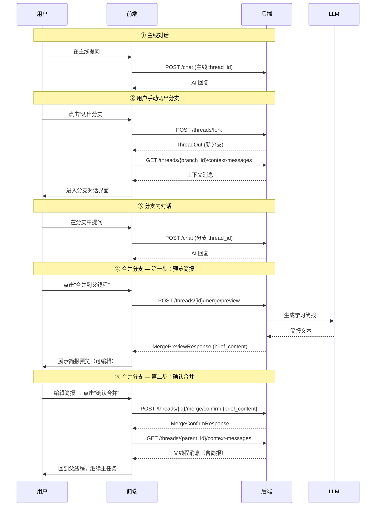
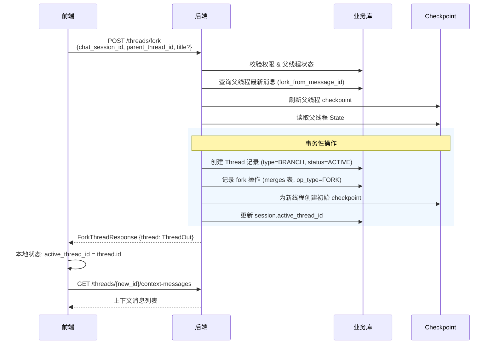
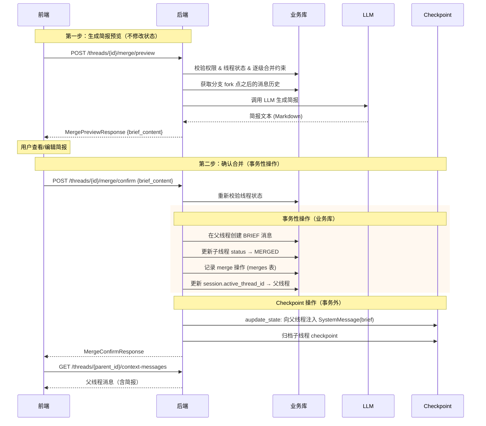
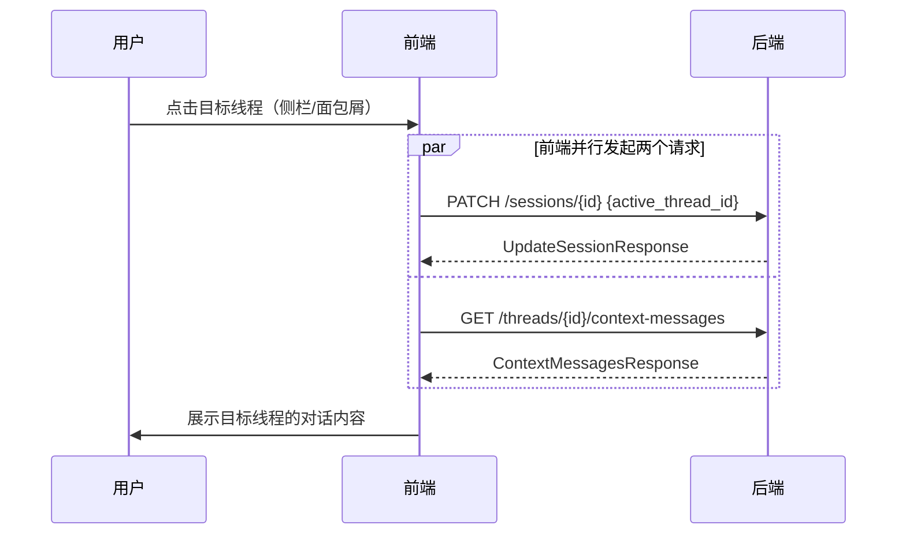

# 记忆分支 API 响应设计评审

更新时间：2026-02-11

> 本文档针对 [memory-branch-implementation-guide.md](./memory-branch-implementation-guide.md) 中 §2 API 层设计提出的接口清单，逐一评审其**请求/响应**设计，消除冗余字段，统一公共模型，并讨论消息类型体系和接口编排模式。

---

## 0. 设计原则

1. **操作即同步** — 写操作（fork / merge / switch）的响应应包含所有被变更实体的新状态，前端一次响应即可完成 UI 刷新
2. **消除跨模型冗余** — 如果某个字段已存在于公共模型（如 `ThreadOut`）中，不在外层重复声明
3. **公共模型复用** — `ThreadOut`、`MessageOut` 作为通用输出模型，被所有接口共享

---

## 1. 公共输出模型

### 1.1 ThreadOut

```python
class ThreadOut(BaseModel):
    """线程通用输出模型 — 所有涉及线程的接口复用此 Schema"""
    id: int
    chat_session_id: int                  # 所属会话（原 ForkThreadResponse.session_id 整合至此）
    parent_thread_id: int | None          # 父线程
    thread_type: int                      # 1=MAIN_LINE, 2=SUB_LINE
    status: int                           # 1=NORMAL 2=MERGED
    title: str | None
    fork_from_message_id: int | None      # 切出点消息 ID
    created_at: datetime
```

**设计说明**：
- `chat_session_id` 来自 Thread 领域模型本身具有的字段，不是外挂
- `parent_thread_id` / `fork_from_message_id` 是 fork 关系的自然描述，无需在 Response 外层重复

### 1.2 MessageOut

```python
class MessageOut(BaseModel):
    """消息通用输出模型"""
    id: int
    role: int                             # 1=user, 2=assistant, 3=system
    type: int                             # 1=NORMAL, 2=BRIEF
    content: str                          # 普通消息/学习简报均为纯文本
    thread_id: int                        # 消息所属线程
    created_at: datetime
```

**设计决策**：
- 学习简报（BRIEF）的内容直接存放在 `content` 字段中（Markdown 格式纯文本），不使用结构化 JSON
- 不需要 `metadata` 字段，前端通过 `type` 区分渲染样式即可

> ⚠️ 当前 ORM `Message` 模型缺少 `type` 字段，需要新增（参见 [§4](#4-消息类型体系)）。

---

## 2. 各接口响应设计

### 2.1 `POST /api/v1/threads/fork` — 切出分支

#### 请求体

```python
class ForkThreadRequest(BaseModel):
    chat_session_id: int                  # 所属会话
    parent_thread_id: int                 # 从哪个线程切出
    title: str | None = None              # 分支标题（可选，系统自动生成）
```

#### 响应体

```python
class ForkThreadResponse(BaseModel):
    thread: ThreadOut                     # 新分支完整信息
```

**设计决策**：fork 操作必然将 `active_thread_id` 切换到新分支，这是确定性行为，无需在响应中冗余返回。前端收到 `thread.id` 后自行更新本地状态即可。

#### 冗余消除说明

| 原方案字段 | 处理 | 说明 |
|---|---|---|
| `parent_thread_id` | 移除 | 已在 `thread.parent_thread_id` 中 |
| `fork_from_message_id` | 移除 | 已在 `thread.fork_from_message_id` 中 |
| `session_id` | 移除 | 已在 `thread.chat_session_id` 中 |
| `active_thread_id` | 移除 | fork 必然切换，前端从 `thread.id` 推断 |

---

### 2.2 合并分支（两步流程）

合并操作拆分为**预览**和**确认**两个接口，支持用户在合并前编辑学习简报：

#### 2.2.1 `POST /api/v1/threads/{id}/merge/preview` — 生成简报预览

**请求体**：无（thread_id 从 path 获取）

**响应体**：

```python
class MergePreviewResponse(BaseModel):
    thread_id: int                        # 待合并的分支 ID
    target_thread_id: int                 # 目标父线程 ID
    brief_content: str                    # LLM 生成的学习简报（Markdown 纯文本，可编辑）
```

**业务流程**：

1. 校验权限、线程状态、逐级合并约束
2. 获取分支从 fork 点之后的消息历史
3. 调用 LLM 生成学习简报
4. 返回简报文本（**不修改任何状态**）

> 此接口是安全的“只读”操作（虽然用 POST 因为涉及 LLM 调用），不会改变任何数据库状态。

#### 2.2.2 `POST /api/v1/threads/{id}/merge/confirm` — 确认合并

**请求体**：

```python
class MergeConfirmRequest(BaseModel):
    brief_content: str                    # 用户确认/编辑后的学习简报文本
```

**响应体**：

```python
class MergeConfirmResponse(BaseModel):
    merged_thread: ThreadOut              # 被合并的分支（status 已变为 MERGED）
    target_thread: ThreadOut              # 目标父线程
    brief_message: MessageOut             # 已写入父线程的学习简报消息
```

**业务流程**（事务性）：

1. 重新校验权限、线程状态（防止 preview 和 confirm 之间状态变更）
2. 在父线程创建 BRIEF 类型的消息（`role=system`, `type=BRIEF`, `content=用户编辑后的简报`）
3. 更新子线程状态 → MERGED
4. 记录 merge 操作到 merges 表
5. 更新 `session.active_thread_id` → 父线程
6. **向父线程的 checkpoint 注入简报**（见下方说明）
7. 归档子线程 checkpoint

**Checkpoint 注入机制**：

业务库 `messages` 表只供前端消费，真正驱动 LLM 上下文的是 checkpoint 中的 `GraphState.messages`。合并时必须将简报也写入父线程的 checkpoint，否则 LLM 下次对话时不知道分支里学了什么。

使用 LangGraph 的 `aupdate_state` API 实现注入，**不会触发 LLM 调用**：

```python
from langchain.messages import SystemMessage

async with get_postgres_saver() as saver:
    agent = create_chat_graph(postgres_saver=saver)
    config = {"configurable": {"thread_id": str(parent_thread_id)}}
    
    # GraphState.messages 使用 operator.add 作为 reducer
    # SystemMessage 会被追加到父线程已有的 checkpoint 消息列表末尾
    await agent.aupdate_state(
        config,
        {"messages": [SystemMessage(content=brief_content)]},
    )
```

**原理**：`GraphState.messages` 定义了 `Annotated[list[AnyMessage], operator.add]`，`aupdate_state` 会读取当前 checkpoint → 应用 reducer（追加 SystemMessage）→ 写入新 checkpoint。整个过程不经过 graph 节点，不调用 LLM。

**设计决策**：
- 学习简报是纯文本（Markdown），存储在 `content` 字段中，不使用结构化 JSON
- 响应不包含 `active_thread_id`，因为合并必然切换到父线程，前端从 `target_thread.id` 推断
- confirm 后前端需调用 `GET /threads/{target_id}/context-messages` 加载父线程消息
- **双写顺序**：先写业务库（事务内），再写 checkpoint（事务外）；checkpoint 写入失败时业务库已提交，由补偿机制处理

---

### 2.3 `GET /api/v1/threads/{id}/context-messages` — 获取上下文消息

#### 请求参数

| 参数 | 类型 | 必填 | 说明 |
|---|---|---|---|
| `direction` | string | 是 | `before`（向前）或 `after`（向后） |
| `cursor` | string | 否 | 游标（消息 ID），不传表示从最新/最旧开始 |
| `limit` | int | 否 | 每页数量，默认 20，最大 100 |

#### 响应体

```python
class ContextMessagesResponse(BaseModel):
    messages: list[MessageOut]            # 跨线程的上下文消息列表
    next_cursor: str | None               # 下一页游标
    has_more: bool                        # 是否还有更多
```

#### 关键设计点

1. **`MessageOut.thread_id`** — 上下文消息来自祖先链上的多个线程，每条消息必须标注 `thread_id`，前端可据此做视觉分区（如淡色显示继承自父线程的消息）

2. **`MessageOut.type`** — 区分渲染方式：
   - `NORMAL`(1)：标准对话气泡
   - `BRIEF`(2)：学习简报卡片（Markdown 渲染）

3. **Fork 点分界线** — 可选优化（P1）：在 service 层查询时标记 `is_fork_point`，前端可在此处渲染"从这里进入分支 X"的视觉分界线。MVP 阶段前端可通过比较相邻消息的 `thread_id` 变化自行判断。

---

### 2.4 `PATCH /api/v1/sessions/{id}` — 切换活跃线程

这是讨论最多的接口，核心问题是：

> **"切换线程"这个用户动作 = 切换 active_thread_id + 加载目标线程的消息，需要两个接口调用，是否合适？**

#### 方案对比

| 方案 | 描述 | 优点 | 缺点 |
|---|---|---|---|
| **A. 分离调用** | PATCH 切换 + GET context-messages，前端并行调用 | 职责分离，RESTful；context-messages 可独立复用 | 两次网络请求 |
| **B. 合并响应** | PATCH 切换时返回第一页消息 | 一次请求完成 | 切换接口职责膨胀；如果只更新 title 不需要消息 |
| **C. 隐式切换** | 去掉 PATCH 接口，在 GET context-messages 中用 side-effect 更新 active_thread_id | 最少请求 | GET 有写副作用，违反 REST 语义 |

#### 推荐：方案 A（分离调用，前端并行）

理由：

1. **PATCH 是"持久化状态"，GET 是"获取数据"** — 这是两个独立关注点。PATCH 的作用更像是"记住用户上次在哪个线程"，以便下次打开会话时恢复位置。它不应该成为获取消息的必经之路。

2. **前端并行调用无感知延迟** — 现代前端框架中，两个请求并行发出：
   ```typescript
   // 前端伪代码：两个请求同时发出，不等待 PATCH 结果也可以渲染消息
   const [_, messagesRes] = await Promise.all([
     api.patch(`/sessions/${sid}`, { active_thread_id: threadId }),
     api.get(`/threads/${threadId}/context-messages?direction=before&limit=20`),
   ]);
   renderMessages(messagesRes.messages);
   ```
   用户感知到的是**一次操作**，实际延迟取决于较慢的那个请求（通常是 context-messages），PATCH 本身极快。

3. **context-messages 接口的复用性** — 它不仅在"切换线程"时使用，还在首次进入会话、滚动加载历史等场景独立使用。如果把它嵌入 PATCH 响应，这些场景还是要单独调。

#### 请求体

```python
class UpdateSessionRequest(BaseModel):
    active_thread_id: int | None = None   # 切换到的线程 ID
    title: str | None = None              # 更新会话标题（可选）
```

#### 响应体

```python
class UpdateSessionResponse(BaseModel):
    session_id: int
    title: str | None                     # 会话标题（可能被更新）
    active_thread_id: int                 # 当前活跃线程（已切换）
    active_thread: ThreadOut              # 目标线程基本信息
    updated_at: datetime
```

> 包含 `active_thread: ThreadOut` 是因为前端切换后需要立即更新顶栏（线程标题、分支/主线标签、状态）。

---

### 2.5 `GET /api/v1/threads/{id}/breadcrumb` — 面包屑导航（P1）

#### 响应体

```python
class BreadcrumbResponse(BaseModel):
    breadcrumb: list[BreadcrumbItem]      # 从主线到当前线程的路径
    current_thread_id: int                # 当前所在线程

class BreadcrumbItem(BaseModel):
    thread_id: int
    title: str | None
    thread_type: int                      # 1=MAINLINE, 2=BRANCH
    status: int                           # 1=ACTIVE, 2=MERGED, 3=CLOSED
    fork_from_message_id: int | None      # 前端可用于点击面包屑后定位到 fork 点消息
```

---

### 2.6 `GET /api/v1/sessions/{id}/thread-tree` — 线程树结构（P1）

#### 响应体

```python
class ThreadTreeResponse(BaseModel):
    session_id: int
    active_thread_id: int                 # 当前活跃线程（高亮标识）
    threads: list[ThreadTreeNode]         # 扁平列表，前端用 parent_thread_id 自行构建树

class ThreadTreeNode(BaseModel):
    thread_id: int
    parent_thread_id: int | None
    title: str | None
    thread_type: int                      # 1=MAINLINE, 2=BRANCH
    status: int                           # 1=ACTIVE, 2=MERGED, 3=CLOSED
    fork_from_message_id: int | None
    created_at: datetime
    closed_at: datetime | None
    message_count: int                    # 该线程自身消息数量
    children_count: int                   # 直接子线程数量
```

**为什么用扁平列表而非嵌套树**：  
线程层级通常不深（2-3 层），扁平结构更灵活、JSON 体积可控，前端可自由组装为树/列表/时间线等多种视图。

**`message_count` / `children_count` 的价值**：  
用户看线程树时最想知道"这个分支内容多不多""下面还有没有子分支"。这两个聚合字段需要额外 COUNT 查询，但对信息密度提升显著，建议在此阶段实现。

---

## 3. 接口响应总览

| 接口 | 方法 | 响应核心内容 |
|---|---|---|
| `/threads/fork` | POST | `ThreadOut` |
| `/threads/{id}/merge/preview` | POST | `brief_content`（简报预览文本） |
| `/threads/{id}/merge/confirm` | POST | 两个 `ThreadOut`（merged + target）+ `MessageOut`（brief） |
| `/threads/{id}/context-messages` | GET | `list[MessageOut]` + 分页游标 |
| `/sessions/{id}` | PATCH | session 元数据 + `ThreadOut`（active_thread） |
| `/threads/{id}/breadcrumb` | GET | `list[BreadcrumbItem]` |
| `/sessions/{id}/thread-tree` | GET | `list[ThreadTreeNode]` + `active_thread_id` |

---

## 4. 消息类型体系

### 4.1 类型定义

当前 ORM `Message` 模型只有 `role` 字段，**缺少 `type` 字段**来区分消息的业务类型。

MVP 阶段只需两种类型：

| type 值 | 枚举名 | 说明 | 渲染方式 |
|---|---|---|---|
| 1 | `CHAT` | 普通聊天消息（user ↔ assistant） | 标准对话气泡 |
| 2 | `BRIEF` | 学习简报（合并分支时生成） | 简报卡片（Markdown 渲染） |

> 后续实现自动建议分支功能时，可新增 `BRANCH_SUGGESTION`(3) 类型。

**BRIEF 消息的特征**：
- `role = 3` (system)
- `type = 2` (BRIEF)
- `content` = 学习简报的纯文本内容（Markdown 格式）
- 不需要 `metadata` 字段，简报内容直接存储在 `content` 中

#### 需要的 ORM 变更

`src/infra/db/models/messages.py` 需新增字段：

```python
type: Mapped[int] = mapped_column(SmallInteger, nullable=False, server_default="1")
```

`src/domain/models.py` 的 `Message` 模型需同步新增 `type` 字段。

对应的数据库 migration：

```sql
ALTER TABLE messages ADD COLUMN type SMALLINT NOT NULL DEFAULT 1;
```

### 4.2 前端渲染示意

```
┌─────────────────────────────────────────┐
│ [用户] 帮我部署后端项目到服务器上         │  ← type=NORMAL, role=user
├─────────────────────────────────────────┤
│ [AI] 好的，首先我们需要确认服务器环境...  │  ← type=NORMAL, role=assistant
├─────────────────────────────────────────┤
│ ... (用户手动切出分支, 在分支中探究 Docker) │
├─────────────────────────────────────────┤
│ ... (用户合并分支回到主线)                │
├─────────────────────────────────────────┤
│ ┌─────────────────────────────────────┐ │
│ │ 👉 这是一条消息分界线                  │ │  ← 前端通过 thread_id 变化自行渲染
│ │ "从这里进入分支: Docker 探究"        │ │
│ └─────────────────────────────────────┘ │
├─────────────────────────────────────────┤
│ ─── 以下为合并回主线的学习简报 ───       │
│ ┌─────────────────────────────────────┐ │
│ │ 📋 学习简报：Docker 容器化要点       │ │  ← type=BRIEF, role=system
│ │                                     │ │
│ │ ## 关键结论                          │ │
│ │ - Docker 使用 cgroup + namespace    │ │
│ │ - 镜像是只读分层文件系统            │ │
│ │                                     │ │
│ │ ## 可执行步骤                        │ │
│ │ 1. apt install docker.io            │ │
│ │ 2. docker pull nginx:latest         │ │
│ └─────────────────────────────────────┘ │
└─────────────────────────────────────────┘
```

---

## 5. 设计决策记录

| 编号 | 问题 | 决策 | 理由 |
|---|---|---|---|
| D1 | fork 是否自动切换 active_thread_id | **是，但响应不返回该字段** | fork 必然切换，前端从 `thread.id` 推断 |
| D2 | BRANCH_SUGGESTION 是否纳入 MVP | **否，延后** | MVP 只支持用户手动 fork，枚举值预留位置但不实现 |
| D3 | 合并后是否自动跳转 | **拆分为两步** | 用户需要先预览并编辑简报，确认后才执行合并并跳转 |
| D4 | Brief 存储格式 | **纯文本（Markdown）存 `content`** | 不需要结构化 JSON，不需要 `metadata` 字段 |
| D5 | 消息类型体系 | **MVP 只用 NORMAL + BRIEF** | `type` 字段区分，简单够用 |
| D6 | 切换线程接口设计 | **方案 A：分离调用** | PATCH 切换 + GET 拉消息，前端并行发起，职责分离 |
| D7 | 简报如何注入 LLM 上下文 | **`aupdate_state` 注入 checkpoint** | 利用 LangGraph 原生 API 向父线程 checkpoint 追加 SystemMessage，不触发 LLM 调用 |

---

## 6. 核心流程时序图

### 6.1 完整生命周期：主线 → 切分支 → 分支对话 → 合并回主线



### 6.2 切出分支详细流程



### 6.3 合并分支详细流程（两步）



### 6.4 切换线程流程


