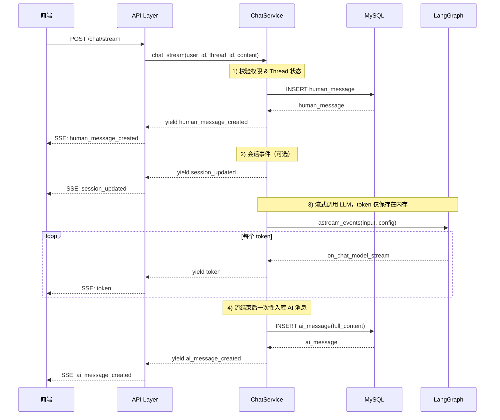

# 流式聊天接口实现指南

> 本文档描述 `POST /api/v1/chat/stream` 接口的技术实现，用于流式传输 LLM 回复。

---

## 目录

- [1. 接口定义](#1-接口定义)
- [2. 技术方案选型](#2-技术方案选型)
- [3. 分层实现设计](#3-分层实现设计)
- [4. 核心代码实现](#4-核心代码实现)
- [5. 前端对接指南](#5-前端对接指南)
- [6. 文件修改清单](#6-文件修改清单)
- [7. 测试要点](#7-测试要点)

---

## 1. 接口定义

### 1.1 基本信息

| 项目     | 值                                    |
| -------- | ------------------------------------- |
| 路由     | `POST /api/v1/chat/stream`            |
| 认证     | Bearer Token（`get_current_user_id`） |
| 响应类型 | `text/event-stream` (SSE)             |

### 1.2 请求体

复用现有 `ChatRequest`：

```python
class ChatRequest(BaseModel):
    chat_session_id: int
    thread_id: int
    content: str
    temp_id: Optional[str] = None  # 前端临时消息 ID，用于乐观更新
```

### 1.3 响应格式 (Server-Sent Events)

采用 SSE 协议，每个事件格式为：

```
event: <event_type>
data: <json_payload>

```

#### 事件顺序（本方案核心）

1. 接收用户消息后，先将用户消息入库并返回用户消息元数据（含 `chat_session_id`）
2. 发送 `session_updated`（如果会话信息有新增/变更，如新会话创建、标题更新）
3. 调用 LLM API，流式返回 token（仅在内存累积，不入库）
4. LLM 回复完成后，再将 AI 完整消息入库并返回 AI 消息元数据
5. 上述步骤完成，本次接口调用结束

#### 事件类型定义

| 事件类型 | 触发时机 | Payload 结构 |
| --- | --- | --- |
| `human_message_created` | 用户消息写入 DB 后 | `{"chat_session_id": int, "thread_id": int, "message": MessageOut}` |
| `session_updated` | 会话创建或会话标题更新后 | `{"chat_session_id": int, "title": str \| null, "reason": str}` |
| `token` | 每个 token 生成时 | `{"content": str}` |
| `ai_message_created` | AI 完整消息写入 DB 后 | `{"chat_session_id": int, "thread_id": int, "message": MessageOut}` |
| `error` | 任意步骤异常 | `{"code": int, "message": str}` |

#### 示例流

```
event: human_message_created
data: {"chat_session_id": 10, "thread_id": 5, "message": {"id": 123, "role": 1, "type": 1, "content": "帮我总结这个PR", "thread_id": 5, "created_at": "2026-02-26T10:00:00Z"}}

event: session_updated
data: {"chat_session_id": 10, "title": "代码评审讨论", "reason": "session_created"}

event: token
data: {"content": "好的"}

event: token
data: {"content": "，我来"}

event: token
data: {"content": "总结一下"}

event: ai_message_created
data: {"chat_session_id": 10, "thread_id": 5, "message": {"id": 124, "role": 2, "type": 1, "content": "好的，我来总结一下", "thread_id": 5, "created_at": "2026-02-26T10:00:02Z"}}
```

---

## 2. 技术方案选型

### 2.1 流式传输方案对比

| 方案 | 优点 | 缺点 | 适用场景 |
| --- | --- | --- | --- |
| **SSE** | 简单、HTTP 原生、自动重连 | 单向通信 | ✅ LLM 流式输出 |
| WebSocket | 双向通信、低延迟 | 连接管理复杂 | 实时互动场景 |
| HTTP Chunked | 简单 | 无事件语义、重连需自己实现 | 大文件下载 |

**决策**：使用 **SSE**。

### 2.2 持久化策略对比

| 策略 | 行为 | 风险 |
| --- | --- | --- |
| 预创建 AI 占位消息 | 先插入空 AI 消息，结束后更新 | 中断时可能遗留空消息/脏数据 |
| **完成后再写 AI 消息（本方案）** | token 期间仅内存累积，完成后一次 INSERT | 中断时 AI 不落库（可接受） |

**决策**：采用“AI 完成后再入库”的策略，避免空消息残留，数据语义更清晰。

### 2.3 LangGraph 流式 API

利用 `astream_events` 获取 token 级事件：

```python
async for event in graph.astream_events(input, config, version="v2"):
    if event["event"] == "on_chat_model_stream":
        token = event["data"]["chunk"].content
        yield token
```

---

## 3. 分层实现设计

### 3.1 架构流程图

```
┌─────────────┐    POST /chat/stream    ┌─────────────┐
│   前端      │ ────────────────────▶   │  API Layer  │
│  (SSE)      │ ◀────── SSE Stream ──── │  (FastAPI)  │
└─────────────┘                         └──────┬──────┘
                                               │
                                               ▼
                                        ┌─────────────┐
                                        │   Service   │
                                        │   Layer     │
                                        └──────┬──────┘
                                               │
                    ┌──────────────────────────┼──────────────────────────┐
                    │                          │                          │
                    ▼                          ▼                          ▼
            ┌─────────────┐           ┌─────────────┐            ┌─────────────┐
            │   MySQL     │           │  LangGraph  │            │  Postgres   │
            │  messages   │           │   Graph     │            │ Checkpoint  │
            └─────────────┘           └─────────────┘            └─────────────┘
```

### 3.2 时序图



---

## 4. 核心代码实现

### 4.1 Schema 层

**路径**: `src/api/schemas/chat.py`

```python
from enum import Enum


class StreamEventType(str, Enum):
    HUMAN_MESSAGE_CREATED = "human_message_created"
    SESSION_UPDATED = "session_updated"
    TOKEN = "token"
    AI_MESSAGE_CREATED = "ai_message_created"
    ERROR = "error"


class StreamHumanMessageCreated(BaseModel):
    chat_session_id: int
    thread_id: int
    message: MessageOut


class StreamSessionUpdated(BaseModel):
    chat_session_id: int
    title: str | None = None
    reason: str = "title_updated"


class StreamAIMessageCreated(BaseModel):
    chat_session_id: int
    thread_id: int
    message: MessageOut


class StreamToken(BaseModel):
    content: str


class StreamError(BaseModel):
    code: int
    message: str
```

> `human_message_created` 与 `ai_message_created` 使用包装结构，兼顾消息元数据与会话上下文（`chat_session_id`）。

### 4.2 API 层

**路径**: `src/api/v1/endpoints/chat.py`

```python
import json
from fastapi.responses import StreamingResponse


def format_sse(event: str, data: dict) -> str:
    return f"event: {event}\ndata: {json.dumps(data, ensure_ascii=False, default=str)}\n\n"


@router.post("/stream")
async def chat_stream(
    chat_request: ChatRequest,
    user_id: int = Depends(get_current_user_id),
    db_session: AsyncSession = Depends(get_db_session),
) -> StreamingResponse:
    async def event_generator():
        service = ChatService(db_session)
        try:
            async for event_type, payload in service.chat_stream(
                user_id=user_id,
                chat_session_id=chat_request.chat_session_id,
                thread_id=chat_request.thread_id,
                content=chat_request.content,
            ):
                yield format_sse(event_type.value, payload.model_dump())
        except Exception as e:
            error = StreamError(code=5000, message=str(e))
            yield format_sse(StreamEventType.ERROR.value, error.model_dump())

    return StreamingResponse(
        event_generator(),
        media_type="text/event-stream",
        headers={
            "Cache-Control": "no-cache",
            "Connection": "keep-alive",
            "X-Accel-Buffering": "no",
        },
    )
```

### 4.3 Service 层

**路径**: `src/app/services/chat_service.py`

```python
from typing import AsyncGenerator


class ChatService:
    async def chat_stream(
        self,
        user_id: int,
        chat_session_id: int,
        thread_id: int,
        content: str,
    ) -> AsyncGenerator[tuple[StreamEventType, BaseModel], None]:
        # 1) 新会话场景
        if chat_session_id == 0 and thread_id == 0:
            chat_session_id, thread_id = await self._create_new_session_and_thread(
                user_id=user_id,
                title=None,
            )

        # 2) 校验 thread
        thread = await self.thread_repo.get(thread_id)
        if thread is None or thread.status != 1:
            raise BadRequestException(
                message=f"Thread with id {thread_id} is not active or does not exist"
            )

        # 3) 用户消息先入库并返回元数据
        human_message = Message(
            role=MessageRole.USER,
            content=content,
            chat_session_id=chat_session_id,
            thread_id=thread_id,
            user_id=user_id,
            type=MessageType.CHAT,
        )
        human_message = await self._save_message(human_message)
        yield (
            StreamEventType.HUMAN_MESSAGE_CREATED,
            MessageOut.model_validate(human_message),
        )

        # 4) 流式生成 token，内容仅保存在内存
        model_config = await self.get_model_config(1)
        full_content = ""
        async for token in self._stream_llm(content, thread_id, model_config):
            full_content += token
            yield (StreamEventType.TOKEN, StreamToken(content=token))

        # 5) AI 完整消息生成后再入库，并返回元数据
        ai_message = Message(
            role=MessageRole.ASSISTANT,
            content=full_content,
            chat_session_id=chat_session_id,
            thread_id=thread_id,
            user_id=user_id,
            type=MessageType.CHAT,
        )
        ai_message = await self._save_message(ai_message)
        yield (
            StreamEventType.AI_MESSAGE_CREATED,
            MessageOut.model_validate(ai_message),
        )
```

### 4.4 异常处理建议

- 若在 token 阶段发生异常：返回 `error` 事件，不写入 AI 消息
- 若前端中途断开：终止生成，释放资源，不补写 AI 消息
- 日志中记录 `chat_session_id/thread_id/user_id` 便于追踪

---

## 5. 前端对接指南

### 5.1 事件处理建议

- `human_message_created`：从 `data.chat_session_id` 保存会话 ID，并用 `data.message.id` 替换本地临时用户消息
- `session_updated`：更新会话标题/会话信息（例如新建会话后标题回填）
- `token`：将 token 追加到当前“正在生成”的 AI 气泡（仅前端状态）
- `ai_message_created`：用 `data.message` 替换临时 AI 气泡并结束 loading
- `error`：展示错误并结束 loading

### 5.2 fetch + ReadableStream（推荐）

```typescript
switch (eventType) {
  case 'human_message_created':
        onHumanMessageCreated(data as {
            chat_session_id: number;
            thread_id: number;
            message: MessageOut;
        });
        break;
    case 'session_updated':
        onSessionUpdated(data as {
            chat_session_id: number;
            title: string | null;
            reason: string;
        });
    break;
  case 'token':
    onToken(data as { content: string });
    break;
  case 'ai_message_created':
        onAiMessageCreated(data as {
            chat_session_id: number;
            thread_id: number;
            message: MessageOut;
        });
    break;
  case 'error':
    onError(data);
    break;
}
```

---

## 6. 文件修改清单

| 文件路径 | 修改内容 |
| --- | --- |
| `src/api/schemas/chat.py` | 新增 `StreamEventType`（human/session/token/ai/error）与流式 payload |
| `src/api/v1/endpoints/chat.py` | 新增 `/stream` 端点与 SSE 输出格式 |
| `src/app/services/chat_service.py` | 按“四阶段”实现：用户入库 → session_updated → token 流式输出 → AI 完成后入库 |

---

## 7. 测试要点

### 7.1 单元测试

- `chat_stream` 校验 thread 状态逻辑
- 事件顺序断言：`human_message_created -> session_updated?(可选) -> token* -> ai_message_created`
- 异常场景断言：token 阶段异常时不会写入 AI 消息

### 7.2 集成测试

- 端到端流式响应：请求后按顺序收到三类事件
- DB 校验：用户消息有记录，AI 消息仅在生成完成后出现
- 中断场景：客户端断开后，AI 消息不入库

### 7.3 压力测试

- 并发流式请求的资源占用（CPU/内存/连接数）
- 长回复（如 4K tokens）稳定性
- 客户端频繁中断场景下系统恢复能力
